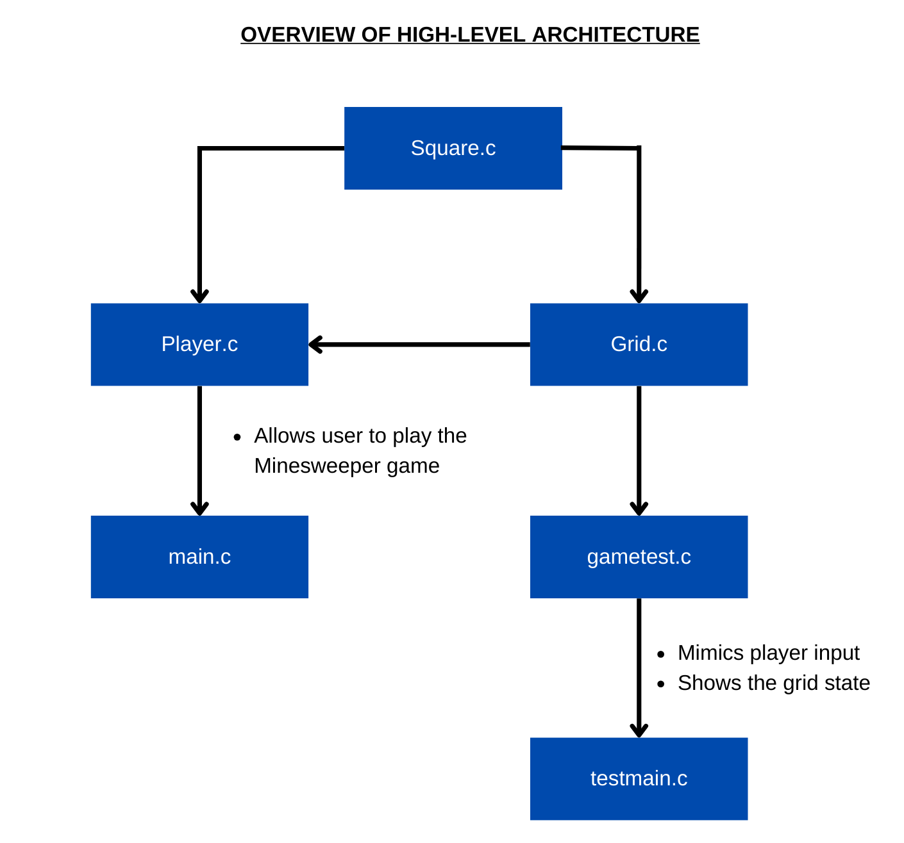
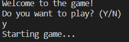
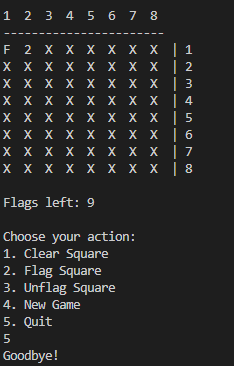
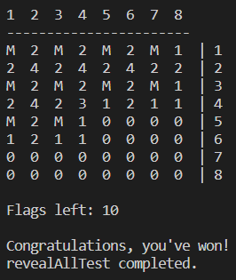
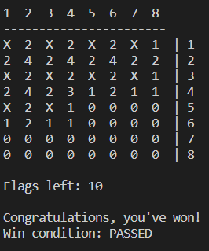
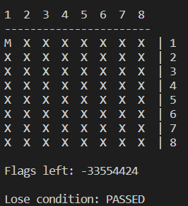

# DukosiMinesweeper

Creating a minesweeper game using C language for Dukosi C language challenge.
# High Level Architecture



The overall diagram shows that two application (.exe) is being created, the main game, minesweeper.exe, and the test application, test_application.exe. 

In future cases, the GUI aspect can be implemented using the functions inside the Player.c and Grid.c header files.
# Instructions

Here are the instructions on how to play the game. This is done by compiling and creating the files
```
gcc -c main.c -o main.o
gcc -c grid.c -o grid.o
gcc -c square.c -o square.o
gcc -c player.c -o player.o
gcc main.o grid.o square.o player.o -o minesweeper
```

and then running the application by
```
./minesweeper
```
in the console.



The user can input "y" for yes or "n" for no if they want to play the game.

If "y", then the grid will be outputted at the console with some instructions on choosing which action to do:

1. Clear Square
2. Flag Square
3. Unflag Square
4. New Game
5. Quit



For choice 1, 2, and 3, the console will prompt the user to input the x and y co-ordinates in revealing, flagging or unflagging the squares. As shown above, the square at (1,1) has been flagged by the user after choosing the 2nd choice and inputting the co-ordinates.
# Test Output

These are the test results which shows the revealed grid states which contains the mine and adjacent mine squares, the winning state, and the losing state. These can be done by running the instruction in the console,
```
gcc -c testmain.c -o testmain.o
gcc -c grid.c -o grid.o
gcc -c square.c -o square.o
gcc -c gametest.c -o gametest.o
gcc testmain.o grid.o square.o gametest.o -o test_application
```
and then running the application
```
./test_application
```
## Revealed State


## Winning State


## Losing State


